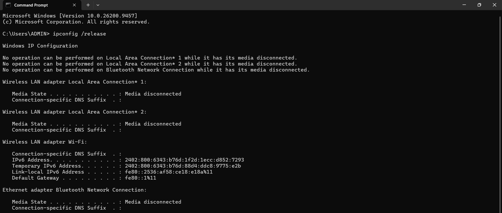
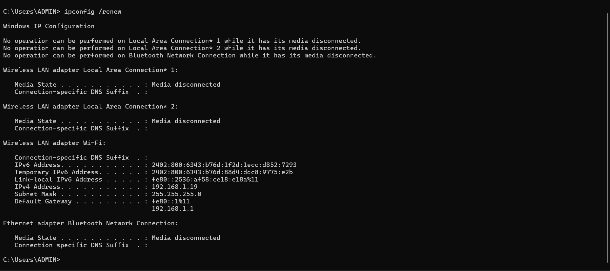
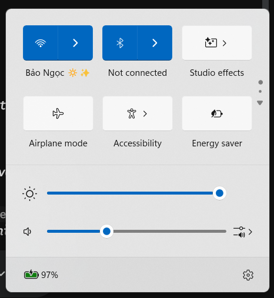

## Nhiệm vụ 2.1: Xử lý sự cố kết nối Wi-Fi

* **Công cụ AI tham vấn:** Gemini (Google Bard)
* **Prompt sử dụng:** "Cách khắc phục lỗi Wi-Fi không kết nối trên Windows 10."

**Các bước thực hiện và Kết quả:**
1. **Tham vấn AI:** Sử dụng công cụ AI (Gemini) với câu lệnh trên và nhận được các giải pháp đề xuất bao gồm: kiểm tra trình điều khiển (driver), khởi động lại router, và chạy các lệnh làm mới IP trong Command Prompt.
2. **Thực hiện khắc phục:** Tiến hành mở Command Prompt bằng quyền Administrator và chạy lần lượt các lệnh `ipconfig /release` để giải phóng IP cũ và `ipconfig /renew` để yêu cầu router cấp lại IP mới.
3. **Kết quả:** Quá trình xin cấp lại IP thành công, máy tính đã khôi phục kết nối Wi-Fi hoạt động bình thường.

**Hình ảnh minh chứng:**
* Cửa sổ Command Prompt thực thi lệnh Release IP:
  
* Cửa sổ Command Prompt thực thi lệnh Renew IP:
  
* Trạng thái kết nối Wi-Fi thành công:
  
  ---

## 4. Nguồn dẫn

* Toàn bộ quy trình tra cứu và các bước xử lý kỹ thuật được thực hiện dưới sự hỗ trợ và tham khảo từ công cụ AI (Gemini).
